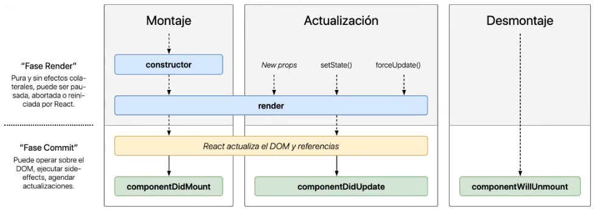

# React js

## Definición

> Biblioteca(Librería) para construir **interfaces**, el propósito es la Vista

### Virtual DOM

`Document Object Model`: estructura del árbol del html en el navegaor

`virtual DOM`: copia exacta del DOM en memoria, que funciona para conocer el estado de la paguina y que parte del DOM a cambiado en el documento y de esta manera rendereza solo esa parte de la jerarquía de elementos en el DOM real

## Instalar

### Pasos

1. tener `nodejs` version *lts* y `npm`

2. instalar **Create React App**: libreria que configura toda la estructura del projecto `Reactjs`

   `npx create-react-app nombrecarpeta` para instalar el projecto react en la dir `nombrecarpeta` sin instalar la libreria

### Yarn

gestor de dependencias como nmp creado por facebook para react

`npm install -g yarn` para instalarlo desde npm (-g lo instala de forma global)

`yarn start` inicia el proyecto en el browser

- **instalar complemento para navegador react developer tools** adiciona una nueva pestaña en las developer tools del navegador para *react* 

## Package.json

> objeto json donde estan los detalles y config del proyecto (name, )

### Dependencias

librerías requeridas para que funcione el proyecto, descarga las dependencias declaradas en el objeto recursivamente ej: [react, react-dom, react-scripts]

```json
"dependencies": {
    "react": "^16.8.6",
    "react-dom": "^16.8.6",
    "react-scripts": "3.0.1"
  },
```

`react` core de react

`react-dom` para usar el virtual dom

`react-scripts` para usar los scripts de react en la consola

### Scripts

listado de scripts que se pueden ejecutar en la CLI, `propiedad: valor`, se ejecutan con comano `npm nombre_script`

```json
"scripts": {
    "start": "react-scripts start",
    "build": "react-scripts build",
    "test": "react-scripts test",
    "eject": "react-scripts eject"
  },
```

`npm start` inicia un servidor de desarrollo, con auto refersh del navegador 

`npm run build` para crear el build del proyecto para producción

### Integracion con librerias

`npm i ed-grid` instala dependencia ed-grid

`npm i ed-grid edteam-style-guides node-sass` instala ed-grid,  edteam-style-guides, node-sassde en el server react

> ver si no se cambia `i` por `add`

## JSX

> (javascript xtended)sintaxis creada por facebook para extender javascript, JS + XML, no es HTML es JSX 
>
> `const App = () =><h1> Hola mundo </h1>`

### Reglas

- la extencion es `fichero.jsx`
- siempre tiene apertura y cierre <>    </>
- solo se retorna un elemento padre, dentro puede tener la sintaxis q sea
- apoyarse en los fragment para retornar mas de un elemento
- `img` siempre se cierran `/>` 
- `class` es **className**
- `for`  **htmlFor**
- no se se pueden usar instrucciones `if`, `else` o `while` 
- **El resto de la sintaxis HTML es valida en JSX**

### ReactDOM.render

`ReactDOm.render(elemento, dondehtml)` renderiza un elemento creado en `dondehtml` elemento del html 

```javascript
// codigo h1 creado en JSX lo inserta en div "root"
ReactDOm.render(<h1>hola mundo</h1>, getElementById("root"))
```

### Importar JSX

​		index.js

​		para importar componente JSX <App /> siempre usar /> y un espacio <App />

```javascript
import React from 'react';
import ReactDOM from 'react-dom';
import App from './App';
// para importar componente JSX <App /> siempre usar /> y un espacio <App />
ReactDOM.render(<App />, document.getElementById('root'));
```

​		App.js

```javascript
import React from 'react';
function App() {
  return (
    <div>
     Hola Mundo
    </div>
  );
}
export default App; // permite exportar para su uso
```

### Fragmentos

se usa como padre para no ensuciar con `div`, no se renderiza en el navegador : `<Fragment>` o `<>`

```javascript
function App() {
  return (
  <Fragment>
    <div>Hola Mundo </div>
    <div>Hola Mundo 2</div>
   </Fragment>
  );
}

function App() {
  return (
  <>
    <div>Hola Mundo </div>
    <div>Hola Mundo 2</div>
   <>
  );
}
```

### Expreciones

para escribir `javascript` en JSX con { js } y admite retornar componentes jsx y 

```javascript
<>
    <div>Hola Mundo </div>
    { 1 + 1} // javascrip codigo
    <div>Hola Mundo 2</div>
<>
        
// ej. retornar JSX
const edad = 20;
<>
    <div>Hola Mundo </div>
    { edad > 10 ? <p>Mayor de edad </p> : <div>menor de edad </div>} // javascrip codigo
    <div>Hola Mundo 2</div>
<>   
```

son los atributos de los componentes en html pero en jsx, pueden recivir expreciones jsx

```javascript
// ej. retornar JSX
const edad = 20;
const url = "leo.png"
<>
    <div>Hola Mundo </div>
     // propiedad de url de imagen
    { edad > 10 ? <p>Mayor de edad </p> : <div>menor de edad </div>} // javascrip codigo
    <div>Hola Mundo 2</div>
<>  
```

### Propiedades

pueden recibir un parametro de tipo objeto con todas las propiedades

`const Curso = param => {}` o `const Curso = ({title,descrip}) => {}` 

```javascript
// instancia del componente Curso con sus propiedades
<Curso 
	title= "titulo curso"
	descrip= "descripcion del curso"
/>

// Curso
import React from 'react';
 // para recivir las propiedades
const Curso = param => {
  return (
    <div>
     <h3> { param.title }</h3>
      <p>{param.descrip}</p>
    </div>
  );
}

 // para recivir las propiedades directas
const Curso = ({title,descrip}) => {
    return (
    <div>
     <h3> {title}</h3>
      <p>{descrip}</p>
    </div>
  );
}

export default App; // permite exportar para su uso
```

## Componentes

> Estructura reutilizable pero no el contenido, porciones de código que se pueden reutilizar, un componente se pueden reutilizar uno dentro de otro	

### Presentacionales o Funcionales

> se limita a presentar contenido en la interfas, reutilizando una estructura declarada. No procesa loguica por detras (eventos. etc)

- importar react `import React from 'react';` que se utiliza en la propia declaracion del componente usando `React.createElemnt` 
- declarar una funcion con el nombre del componente `const Curso = ({title,descrip}) =>` que recive el objeto `props` , duncion retorna una estructura JSX
- por ultimo se exporta el componente `export default Curso ;` para ser inportado en cualquier parte de la app
- se inmporta en otro componente `import Curso from "./curso"`
- utilizar `<Curso />`   o  `<Curso props:valor/>`

validar props (parametros)

- validacion `props.imagen ?  imagen.png </img> : <p>no hay imagen </p>`

- mediante **PropTypes** 

  ``` javascript
  import PropTypes from 'prop-types'
  const Curso = ({title,descrip}) => {
      return (
      <div>
       <h3> {title}</h3>
        <p>{descrip}</p>
      </div>
    );
  }
  Curso.propTypes = {
      title: PropTypes.string,
      descrip: PropTypes.string
  }
  
  Curso.defaultProps = {
      title: "titulo por defecto",
      descrip: "descrip defecto"
  }
  export default App;
  ```

`array.map` utilizarlo  para recorrer arrays este retorna un nuevo array para utilizarlo array.forEach solo lo recorre

```javascript
cursos = [{"datos", "descrip"},
		  {"datos", "descrip"}
		  {"datos", "descrip"}]

 // por cada elemento se dibuja un curso con las propiedades del array
{
	cursos.map( cur => <Curso title={cur.title} descrip={cur.descrip}/>)
}
```

### De Clases

> es una clase q extiende de React.Component

```javascript
import React, {Component} from "react" // destructuracion React,{Component}

class Formulario extends Component {
	
	// utilizar cuando sea encesario los parametros
	constructor(props){
		super(props)
	}
	
	// obligatorio retorna contenido del componente
	render() {
        return (
            <div> Aqui el codigo JSX </div>
        )
    }
}

export default Formulario
```

#### Estado

ejemplo de formulario: con el `estado` es un objeto solo del componente, hace que la información del componente cambie, el estado no se le puede pasar al padre ni otro componente solo al hijo como `props` no como estado

```javascript
import React, {Component} from "react"
class Formulario extends Component {
	
	constructor(props){
        super(props)
        
        this.state = {
            name: "",
            edad: 0
        }
	}
	
	render() {
        return (
            <div className="ed-grid">
                <h1>Formulario</h1>
                <form>
                    <div className="form__item">
                        <label>Nombre Completo</label>
                        <input type="text"/>
                    </div>
                    <div className="form__item">
                        <label>Correo Electronico</label>
                        <input type="email"/>
                    </div>
                    <div className="form__item">                        
                        <input type="submit" value="Enviar" className="button full"/>
                    </div>
                </form>
                <div>
                    <h2>{ `Hola ${this.state.name}` } </h2>
                    <p>{ `de edad ${this.state.edad}` }</p>
                </div>
            </div>  
        )
    }
}
export default Formulario
```

#### cambiar estados

`this.setState(obj)` recibe un objeto el cual se encarga de cambiar los valores del estado del componente

se pueden utilizar los eventos js para manejar los estados

```javascript

<input type="text" onChange={ e => {this.setState({
        name: e.target.value
    })} 
 }/>
```

#### metodos y bind

```javascript
constructor(props){// 
    super(props)        
    this.state = {            
        email: ""
    }
    this.cambiarEmail = this.cambiarEmail.bind(this) // binding al this
}    
cambiarEmail(e){// metodo para cambiar el email
    this.setState({
        email: e.target.value
    })
}    
   // llamada al metodo cambiarEmail() desde el componente
<input type="email" onChange={
    this.cambiarEmail
}/>
```

#### Ciclo de Vida

describe el flujo de los métodos del **componente** cuando se realizan las acciones de *Montaje, Actualización o desmontaje*  



- `contructor()` donde se inicializan y definen el estado y métodos de la clase
- `render()` método que retorna el objeto de formato JSX para ser renderizado por la app
- `componentDidMount()` método llamado después que se monta el componente todos los datos son cargados cuando termina el render
- `componentDidUpdate(prevProps, prevStates)` cuando se actualiza el componente *prevProps, prevState* recibe los parámetros y estados previos
- `componentWillUnmount()` después de desmontando el componente al terminarlo