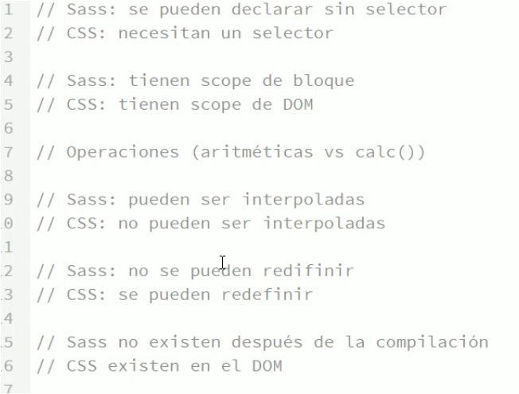

SASS

## Conceptos

>  `Sass`es un Superset de `CSS` preprocesador

- problemas de Css palano 
	1. Escalabilidad
	1. no es programacion
	2. Espesificidad, cascada y herencia
	3. modularizacion
	
	
	
- pasos para empesar

  1. compatible style.css -> style.scss
  2. Modularizacion -> divide tu hoja de estilo en varios archivos
  3. Importa desde archivo principal
  4. Complila

```
		www
	Sassmeister.com
	color.adobe.com
	afinity design
```

---

## Sintaxis
Sass -> desuso no recomendad  
Scss -> recomendad sintaxis = a css

### Comentario	
// -> no se ven en compilacion
/**/ -> si se ven en compilacion

### Importar

_nombre.sass

- `@import "ruta/nombre"`; importa _nombre.sass 
- `(_)`es un partial, es para q el compilador no los complile

### Tipo dato

- `String` con y sin `''`
	
	```scss
	$string : 'Leo'
	$string : Leo
	$string2 : none;		
	
	$var: quote(hola); // add '' retorna: 'hola'
	$var unquote('hola'); // elimina '' retorna: hola
	```
- `Number` permite UM [`px`,`s`,`deg`,`em`]	
	```scss
	$numbre : 1;
	$numbre2 : 10px;
	$numbre3 : 20s;
	
	margin: $numbre2 * 2; // 10px *2 = 20px
	```
- `Color` permite colores exagesimales, `reg`, `hls` etc
			se puede realizar operaciones
	```scss
	$color : red;
	$color2 : rgb(200,125,245);
	$color3 : #fff;

	darken(red, 20); // oscurese
	```
- `Boolean`
	```scss
	$boolean: true
	$boolean: false
	```

- `Listas` separan por `','` o `espacios`

	```scss
	$list : 1px solid red; // conjunto de valores
	$list : primary, secundary, tertiary;
	
	nth($paremetros, $i) // saca el elemento en $i
	```
- `Map` tipo objeto JS `propiedad:valor`
	
	```scss
	 //map parecido a objetos JS
	$map: (
		primary : red;
		secundary : blue;
		tertiary : green;
	);
	map-get($map, primary) // recupera la propiedad del map
	map-keys($map) // recupera las keys
	```

---
## Variables 
comieza` $variable : valor`

- `operaciones` padding: $size - 10;
- `scope` se puede sobresribir en un scope
- `!default` permite sobresribir valor de variables
	```scss
	$color : blue !default;
	```
- `interpolacion` permite interpolar variables y datos `#{$variable}`
	```scss
	//interpola $color retornando : .red | .blue | .yellow
	.#{$color} {
		color: $color;
	}
	
	// calc no permite $var por tanto se interpola
	// para lograr 100% - $size(20,10,35)
	width: calc(100% - #{$size});  

	//@media no permite $var  por tanto se interpola
	// para lograr @media (min-width: 1024)  
	@media usar #{$var} 
	```

---
## Anidamiento(nesting)   
Anidado de selectores y propiedades, usar ***1 nivel de anidamiento no mas !!!***

- `&` repetir el selector padre

	```scss
	.menu{ 
		padding: 0;		
		&:hover{  // es = .menu:hoder {}
			color: red;
		}

		&::before{
			content:'leo';
		}
		
		// anidamiento de clases
		&-item{ // css -> .menu-item
			color: red;
		}
	}
	```
- ### Ejemplo
	> CSS 
	```css
	.menu{ 
		padding: 0
		grid-template-column: 20px 20px;
		grid-template-row: auto;
	}
	.menu .link{ 
		border: 1px solid red;
	}
	```
	> SASS 
	```scss
	.menu{			
		padding: 0;			
		// anidado de propiedad
		grid-template: { 
			column: 20px 20px;
			row: auto;
		}		
		// anidado de selector
		.link{ 
			border: 1px solid red;
		}			
	}
	```
	>SASS 2
	```scss
	ul{
		margin: 0;
		display: block;
		animation: menu-anim 1s;
		
		// anidamiento en css saca por fuera como debe ser
		@media screen and (min-width: 640px){
			display: flex;
		}
		
		// anidamiento en css saca por fuera como debe ser
		@keyframe menu-anim{
			to {
				color : red;
			}
		}

	}
	```

---
## Extend    
`@extend` selector no debemos hacer con mas de ***1 nivel de selectores***, no hacer extend de selectores anidados mejor usar `Placeholder`

- `Placeholder` `(%nombre)` -> trozo de estilos q se pueden reutilizar
	```scss
	%button {
		display: inline;
		margin: 1em 0;
	}
	
	.button {
		@extend %button; // extiende de el placeholder %button
	}
	
	.button-alert {
		color: #fff;
		background: red;
		@extend %button; // extiende de el placeholder %button
	}
	```
- de `Clases`
	```scss
	.button {
		display: inline;
		margin: 1em 0;
	}
	
	.button-alert {
		color: #fff;
		background: red;
		// extiende de la clase .button
		@extend .button;  
	}
	```

---
## Condicionales 
` @if @else`

 and | or | not , etc

```scss
@if condicion {
	estilo;
}@else if condicion{
	estilo2;
}@else condicion{
	estilo3;
}
```

---
## Iteraciones

- ` @for `
	```scss
	@for $i from 1 through 20 {
			.col-#{$i *5} { // interpolacion col-5, col-10 etc 
				width: $i * 5%;
			}
	}
	```

- `@each` -> `$var` sobre una lista o un `map`
	```scss
	$colors : red green blue;
	// listas
	@each $color in $colors {
		.button-#{$color}{    //.button-red
			background: $color; //background: red;
		}
	}
	
	// map
	- $colors : ( 
		primary: red, 
		secundary: green,
		tertiary: blue);
		
	@each @key, $color in $colors {
		.button-#{$key}{   // .button-primary
			background: $color; // background: red;
		}
	}
	```

---
## Mixins  
trozo de código reutilizable tipo funciones
puede devolver trozo de código, css, valor las `funciones` solo retorna un valor

- parametros
	 	```scss
	 @mixin mixins_name($paremetros) {}
	 //valor por defecto
	 @mixin mixins_name($paremetros: red) {} 
	```

- parametros multiples -> `...`
	```scss
	// $paremetros  es una lista
	- @mixin mixins_name($paremetros...) {		
		nth($paremetros, $i)  //saca el elemento en $i
	}
	```
- llamarlo `@include mixins_name`
	
	```scss
	@include mixins_name($parametros)
	// cuando se quiere pasar (n) parametros
	@include mixins_name($parametros...) 
	```
- ### Ejemplo. 
	>se aplica el $parametros a la @media
	```scss
	@mixin buttonmix($breakpoint){
		padding : 1rem;			
		&:hover{
			background: red;
		}				
		@media screen and (min-width: $parametros){
			background: green;
		}
	}
	```
- `@content` permite incluir contenido en el mixin desde la llamada, permite agregar mas reglas no solo un dato como parametros
	```scss
	@mixin menu{
		padding : 1rem;
		display: flex;
		
		.link{
			@content; // aqui se incluira el contenido 
		}
	}
	
	.menu {
		@include menu{ // llama al mixin incluye el contenido {definido} donde esta el @content del mixin
			color: green;
		}
	}
	```
- RWD
	```scss
	$breakpoints : (
		samall: 320px,
		medium: 640px,
		large: 1024px,
		xlarge: 1466px
	);
	
	@mixin mq($breakpoint){
		// verifica q el map contenga la key
		@if map-has-key($breakpoints, $breakpoint){ 
			// obtener el valor del map
			@media screen and (min-width: map-get($breakpoints, $breakpoint)){ 
				@content; // permite incluir contenido
			}
		}@else if type-of($breakpoint) == number and unit($breakpoint) == px {
			// pasa el $brakpoint a la @media
			@media screen and (min-width: $breakpoint){ 
				@content; // permite incluir contenido
			}
		}
	
	}
	
	// llamarlo
	
	@media screen and (min-width : large);
	@media screen and (min-width : 300px);
	```

---
## Funciones 
(`-`) realizan calculos y siempre retornan un valor
al contratio de los `mixin` que pueden devolver trozo de codigo, css, valor  	

### Personalizadas `@function`
```scss
@function name-func($parametro) {
	//codigo
	@return valor
}

selector{
	color : name-func(); // uso funcion
}
```
> de px a em
```scss
@function em($px, $base: 16){
	@return $px / $base * 1em;
}
```

### String

- `quote($var)` -> add comillas
- `unquote($var)` -> remove comillas
- `str-length($var)` -> longuitud
- `str-index($var, $value)` -> index dentro de un string
- `to-upper-case($var)` -> todo mayuscula

### Number

- `percentage($numero)` -> porcentage
- `max(100, 50, 30)` -> el mayor 100
- `min(100, 50, 30)` -> el menor 100
- `float`, `round`, `ciel`
- `random(15)` entre 0 y limite 15 si no esta 1

### Lista

- `nth($list, n)` -> n la posicion del elemento en $list
- `index($list, n)` -> el indice de un elemento
- `join($list1, $list2, $list3, separador: space | comma)` une las listas y puede tener el separador como elemento final
- `append($list,$value, separador: space | comma)` -> add valor al final de la lista

### Maps

-` map-get($map, $key)` -> valor del key en el map
- `map-keys($map, $key) `-> todas las keys del map
- `map-values($map) `-> todas los valores del mapa
- `map-has-key($map,$key)` -> si contiene el key
- `map-merge($map1, map2)` -> une los mapas como join

### Funciones de Intropeccion

- `inspect()` -> debuelve el valor q esta en el parametro como console.log()
- `type-of()` -> retorna el tipo de dato
- `unit(10px)` -> retorna las UM de un numero ej.-> px
- `unitless(10px)` -> retorna true si en numero no tiene UM, o false en lo contrario
- `mixin-exists($mixin-name)` -> boolean
- `function-exists($function-name)` -> boolean
- `variable-exists($var-name)` -> boolean
- `global-variable-exists($var-name)`-> boolean

---
## Color

- ### Color sustrativo -> (pinturas, imprenta)
	```
	`CMYK` - cyan, magenta, yellow, black
	```
- ### `Color aditivo` -> (luz, pantalla)
	
	-  `RGB` -> `red`, `green`, `blue`
	          255, 255, 255 == 2^8, 2^8, 2^8    comienza en 0 16Millones colores = profundidad de color 24bits
		- `notacion hexadecimal`
			#RRGGBB -> RR- red | GG - green | BB-blue
			16 valores posible -> 0123456789ABCDEF
			#f2A | #ccc | #576
			
		
	- `HSL` -> `hue`, `saturation`, `lighten`  

		`hue` -> tono color 0 a 360 todos los colores  
		`saturation` -> intencidad del color de gris al color puro 100%  
		`lighten` -> la cantidad de luz 0%(negro) a 100%(blanco) 50% color puro
		background: hsl(200, 100, 50)
	
		-  0/360 -> red  	RGB
		-  60 -> yellow     CMY
		-  120 -> green  	RGB
		-  180 -> cyan		CMY
		-  240 -> blue		RGB
		-  300 -> magenta   CMY
		
	> ***`OJO Nota`***  
	 `HSL` != `HSB` -> no es compatible con web y es el q trae photoshop y otros programas


### Funciones de colores

- RGB
	```scss
	//retornan cantidad de color
	red($color);  
	green($color);   
	blue($color); 
	background: red(hsl(60,100,50)); // retorna 12.75 de blue
	```
- HSL
	```scss

	hue($color); |  saturation($color); | lightness($color);
	
	//canal de luz
	darken($color, cantidad); // oscurese el color una canditad
	lighten($color, cantidad); // luminosidad el color una canditad
	//canal de saturacion
	saturate($color, cantidad);// satura el color una canditad
	dsesaturate($color, cantidad); // desatura el color una canditad
	//rota el tono de color
	adjust-hue($color, cantidad); // cambia el hue en una cantidad
	```

---
> Videos Para ver 'Curso de Sass - Edteam'
>* 6.1 - Opciones de compilación
>* 6.2 - Sourcemaps		

---
## Debugin  
en la terminal VScode

- `@debug` -> como un consol.log JS 
- `@warn` -> envia mensaje alerta a la consola
- `@error` -> detiene la compilacion

---
## Estructura proyecto 

- ### metodologias

  	- `SMACSS`  

    		`base`  -> los estilos aplicados a etiquetas html(body,p,a,div) es cini tu normalize  
   
    ​		`modulos` -> componentes reutilizables (menus, botones, tarjetas etc)  
   
    ​		`layout` -> geometria y posicion de los elementos (donde esta todo arriba abajo derecha izq)  
   
    ​		`theme` -> tipografia y color la identidad visual de la marca o empresa  
   
    ​		`estado` -> elementos q cambian (animaciones ocultan trasforms)
   
     -  `ITCSS` 
    
     -  `7en1` -> 7 carpetas y un scss
  
      
  
- ### Estructura EDteam	
	```scss
	- index.html
	- css
		style.css           // archivo generado por el SASS	
	- scss
		style.scss			// archivo inicial de donde se @import el resto
		components
			_base.scss 		// inicializar variables y config 
			_buttons.scss   // declara botones
		mixins
			_mixin.scss		// mixins
	```

